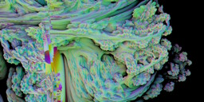
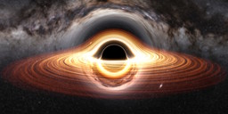
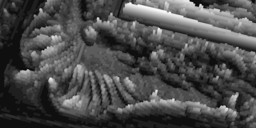

---

### Web graphics demo

This repository contains some demos I made to learn WebGL2. They can be viewed using the link below if your browser and device supports WebGL.

> [https://martzin23.github.io/web-graphics-demo/](https://martzin23.github.io/web-graphics-demo/)

---

### The demos

<table>
    <tr>
        <td>
            
<strong>Fractal ray marcher</strong>

            <!-- <small><em>(code has been migrated to <a href="">another repository</a>)</em></small> -->
        </td>
        <td></td>
    </tr>
    <tr>
        <td><strong>Gravitational lensing simulation</strong></td>
        <td></td>
    </tr>
    <tr>
        <td><strong>Voxel ray traversal</strong></td>
        <td></td>
    </tr>
    <tr>
        <td>
            
<strong>2D particle animation</strong>

            <small><em>(backround of the main page)</em></small>
        </td>
        <td></td>
    </tr>
</table>

---

